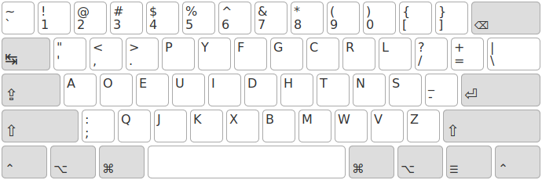

&lt;x-keyboard&gt;
================================================================================

A zero-dependency web component to display and emulate keyboard layouts.

[Online demo here.](https://fabi1cazenave.github.io/x-keyboard/)

Keyboard Layouts
--------------------------------------------------------------------------------

This component uses [Kalamine][1] layouts in a JSON format describing:

- the base and AltGr/Option layers, i.e. the characters that each key outputs;
- the list of all dead keys used by the layout;
- the default keyboard geometry.

  [1]: https://github.com/fabi1cazenave/kalamine/

All keyboard layouts used in the demo page are defined in the `layouts.yaml` directory,then converted to JSON by Kalamine (see `layouts`).

Layout Emulation
--------------------------------------------------------------------------------

Once the keyboard layout is loaded, emulating it should be straight-forward (see `demo.js`). This relies on the [KeyboardEvent][2]’s [code][3] property, which excludes IE & Edge at the moment.

  [2]: https://developer.mozilla.org/en-US/docs/Web/API/KeyboardEvent
  [3]: https://www.w3.org/TR/uievents-code/#code-value-tables

Supported Browsers
--------------------------------------------------------------------------------

Works with Firefox and Chrome and probably all browsers with native web component support.
